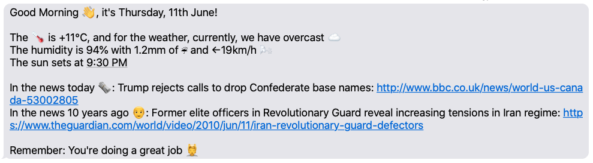

# Curtains
🌅 Receive a customised SMS every morning using Twilio, Amazon CloudWatch Events & AWS Lambda.



  

## Table of Contents
- [Motivation](#motivation)
- [Features](#features)
- [Source Contents](#source-contents)
- [How to Use?](#how-to-use)
  - [Prerequisites](#Prerequisites)
  - [Setup Guide](#setup-guide)
    - [Before Starting](#before-starting)
    - [Code](#code)
    - [AWS](#aws)
- [To Do](#to-do)
- [Acknowledgments](#acknowledgments)
- [Contributing](#contributing)
- [License](#license)

## Motivation
Waking up, I would frequently get distracted, checking other apps after I'd looked at the weather on my phone. Since this app uses SMS, I can still stay informed about the day and prevent distraction from happening by keeping my phone offline until I'm ready to start the day.

## Features
- **Weather Reporting:** *actual temperature, weather condition, humidity, precipitation, wind & sunset time.*
- **News:** *today's top headline with link to story & historic headline with link to story.*
- **Affirmation:** *an affirmation.*

Weather and news are customisable. App design allows for new components to be added easily.

## Source Contents
The project source includes function code and supporting resources:

- `CurtainsFunction/src/main` - Java code to run the function.
- `CurtainsFunction/src/test` - Unit tests.
- `CurtainsFunction/pom.xml` - A Maven build file.

Use the following instructions to deploy the application.

## How to Use?

### Prerequisites
- [An AWS account](https://aws.amazon.com/free).
- [A Twilio account](https://www.twilio.com/try-twilio).
  - [A Twilio verified personal phone number](https://www.twilio.com/docs/usage/tutorials/how-to-use-your-free-trial-account#verify-your-personal-phone-number).
  - [A Twilio phone number](https://www.twilio.com/docs/usage/tutorials/how-to-use-your-free-trial-account#get-your-first-twilio-phone-number).
- [A News API API Key](https://newsapi.org/docs/get-started).
- [A The Guardian Open Platform API Key](https://open-platform.theguardian.com/access/).
- [A Java 11 runtime environment](https://docs.aws.amazon.com/corretto/latest/corretto-11-ug/what-is-corretto-11.html).
- [Maven](https://maven.apache.org/docs/history.html).

### Setup Guide

#### Before Starting
- Depending on the size and frequency that you run your function you *may* incur some AWS cost, although this is very unlikely unless you significantly change the application or run it multiple times per day. To check use [this](https://dashbird.io/lambda-cost-calculator/) calculator.
- Sending SMSs via Twilio **will eventually** incur a cost. For the purpose of testing this app you can use Twilio's trial credit, but ongoing use will require payment. See [Twilio's Programmable SMS pricing page](https://www.twilio.com/sms/pricing/) for more details.

#### Code

*This part of the guide is based upon using IntelliJ IDEA, however, the steps should be extremely similar for other IDEs. If you have any issue feel free to reach out.*

1. Complete all of the [requirements](#requirements).
2. [Clone](https://help.github.com/en/github/creating-cloning-and-archiving-repositories/cloning-a-repository) this repo.
3. Open IntelliJ IDEA > on the main menu: *'Open or Import'* > select ```pom.xml``` from the cloned repo and click *'Open'*.
4. Edit the ```MY_TIMEZONE``` variable in [Config.java](https://github.com/followingell/curtains/blob/4d3a1dfdd469ccd55ce8eab5fb149e810f1bce10/CurtainsFunction/src/main/java/curtains/Config.java#L15).
5. Edit [Wttr.java](https://github.com/followingell/curtains/blob/master/CurtainsFunction/src/main/java/curtains/Wttr.java) to adjust weather details following the internal documentation and comments.
6. Edit [News.java](https://github.com/followingell/curtains/blob/master/CurtainsFunction/src/main/java/curtains/News.java) to adjust news details and [lookback period](https://github.com/followingell/curtains/blob/4d3a1dfdd469ccd55ce8eab5fb149e810f1bce10/CurtainsFunction/src/main/java/curtains/News.java#L75) following the internal documentation and comments.
7. Edit [DailyMessage.java](https://github.com/followingell/curtains/blob/master/CurtainsFunction/src/main/java/curtains/DailyMessage.java) if changes were made in steps 5/6 following the internal documentation and comments.
8. Add the environment variables listed in [Config.java](https://github.com/followingell/curtains/blob/4d3a1dfdd469ccd55ce8eab5fb149e810f1bce10/CurtainsFunction/src/main/java/curtains/Config.java)  to IntelliJ's [run configuration](https://www.jetbrains.com/help/objc/add-environment-variables-and-program-arguments.html) for testing. *Note that these do not need "" string qualifiers.*
9. Add the code below to [DailyMessage.java](https://github.com/followingell/curtains/blob/master/CurtainsFunction/src/main/java/curtains/DailyMessage.java).

```java
    public static void main(String[] args) throws IOException {
        String todaysMessage = new DailyMessage().getTodaysMessage();
        System.out.println(todaysMessage);
        // new TwilioSMSSender().sendMessage(todaysMessage);
        // System.out.println("Message sent successfully!");
    }
```
Debug and run with comments to test that your message is formatted correctly. Uncommenting the two lines will send the message to Twilio and then to your ```RECEIVER_PHONE_NUMBER```. **This will charge your Twilio account**, however, you should have trial credit.
10. If you received the message correctly, delete the code above from [DailyMessage.java](https://github.com/followingell/curtains/blob/master/CurtainsFunction/src/main/java/curtains/DailyMessage.java) and edit the [pom.xml](https://github.com/followingell/curtains/blob/master/CurtainsFunction/pom.xml) file, remembering to change [this](https://github.com/followingell/curtains/blob/4d3a1dfdd469ccd55ce8eab5fb149e810f1bce10/CurtainsFunction/pom.xml#L4) author line.
11. Open Intellij's Terminal and write ```mvn package```, then hit ```ctrl + Enter```. Maven should build the project and hopefully display a 'BUILD SUCCESS' message.
12. If this happened, congratulations you can move to the next section!

#### AWS
13. Login to the [AWS Console](https://aws.amazon.com/console/).
14. Search for and select 'Lambda'. Then select your [region](https://docs.aws.amazon.com/awsconsolehelpdocs/latest/gsg/getting-started.html#select-region).
15. Select *'Create function'* > *'Author from scratch'* > set the function name as 'curtainsFunction' > set the runtime as *'Java 11'* and press *'Create function'*.
16. Go to *'Function code'*, click *'Actions'* > select *'Upload a .zip or .jar file'* > find your project's 'target' folder and look for a file called something like: ```Curtains-1.0-SNAPSHOT.jar```. Select this and hit upload.
17. Click *'Edit environment variables'*. Add the environment variables here as you did in step 8, once done press *'Save'*. *Note: you may want to select *'Encryption in transit'*. To see more on how to configure this security feature please see ['Securing environment variables'](https://docs.aws.amazon.com/lambda/latest/dg/configuration-envvars.html).*
18. Scroll down to *'Basic settings'*, select *'Edit'* > change the *'Handler'* to curtains.DailyMessageHandler::eventHandler > set the *'Timeout'* to 40sec > set *'Memory (MB)'* to 192 MB and leave *'Execution role'* as 'Use an existing role' > press *'Save'*. Note that if you have made significant edits to the program you may need to increase both the *'Timeout'* and *'Memory (MB)'* limits.
19. Select *'Add trigger'* > search for 'EventBridge (CloudWatch Events)' > for *'Rule'* click ' *'Create a new rule'* > provide a descriptive name > set *'Rule type'* as 'Schedule expression' >  set the *'Schedule expression'* depending on when you want to receive the message, *for example, daily at 8am UTC is: ```cron(0 8 ? * * *)```* > leave *'Enable trigger'* unchecked > press *'Add'*. **Note: AWS does not use standard unix or quartz cron expression formats.** More detail can be found [here](https://docs.aws.amazon.com/AmazonCloudWatch/latest/events/ScheduledEvents.html).
20. Press *'Select a test event'* > *'Configure test events'* > *'Create new test event'* and select 'Amazon CloudWatch' > provide an *'Event name'* and press *'Create'*.
21. You are now ready to test your app! Press *'Test'*, after some time you should be shown the message 'Execution result: succeeded' and receive your message.
22. If this is the case, enable the CloudWatch Events trigger and voila! You have a working, automated SMS app!

## To Do
- Implement unit tests for functionality that uses environment variables.

## Acknowledgments
- A big thank you to [Matthew Gilliard](https://github.com/mjg123) for the code & walk through in [_'Wake up to Useful Daily Messages with Java and Azure Functions'_](https://www.twilio.com/blog/wake-up-daily-messages-java-azure-functions).

## Contributing
Pull requests are welcome. For major changes, please open an issue first to discuss what you would like to change.

Please make sure to update tests as appropriate.

## License
[Unlicense](https://choosealicense.com/licenses/unlicense/)
